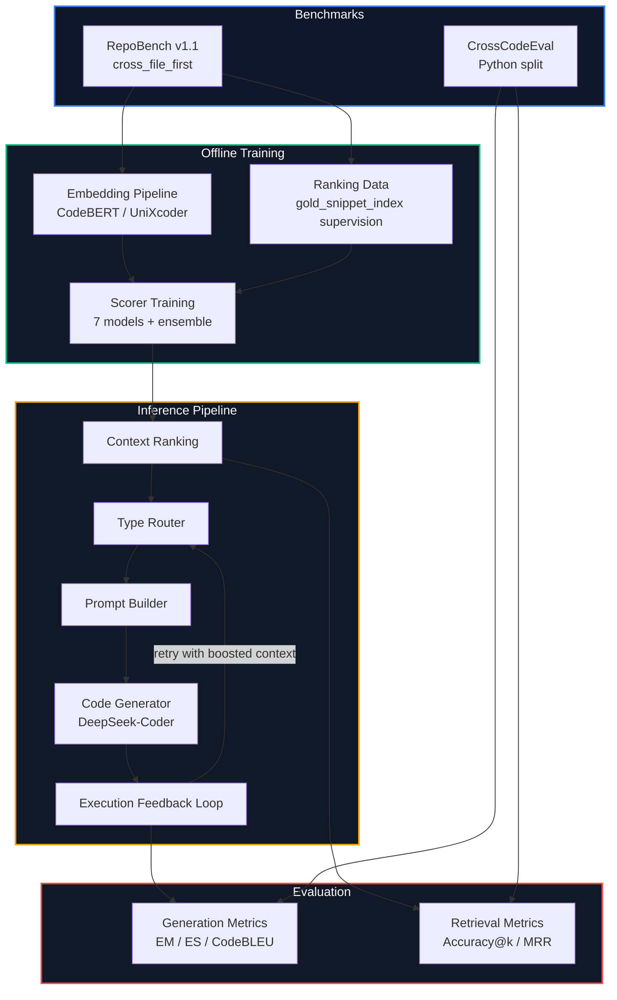

<div align="center">

# HaluGuard

**Execution-Grounded Contrastive Context Selection for Hallucination-Free Repository-Level Code Generation**

[](https://www.python.org/)
[](https://pytorch.org/)
[](https://huggingface.co/docs/transformers/index)
[](https://huggingface.co/datasets/tianyang/repobench_python_v1.1)
[](https://huggingface.co/datasets/ArtifactAI/cceval)
[](https://colab.research.google.com/)
[](#about)

[Features](#features) · [Architecture](#architecture) · [Quick-Start](#quick-start) · [Benchmarks](#benchmarks) · [Model-Zoo](#model-zoo) · [Documentation](#documentation)

</div>

---

## About

HaluGuard is a notebook-first research implementation of the HaluGuard framework from Gupta et al. for reducing code hallucinations in repository-level code generation.

Instead of retrieving code that merely looks similar to the current prompt, HaluGuard ranks context by **hallucination-prevention potential**: imports, type signatures, class and function definitions, and other snippets that help a code model avoid inventing APIs, modules, or method calls that do not exist.

The system combines learned context ranking, type-aware routing, and an execution feedback loop that retries generation after real runtime failures. The repository includes the full training workflow, evaluation pipeline, scorer model zoo, retrieval baselines, and Colab-ready notebooks for running the project end to end.

---

## Features

| Feature | Description |
|:--------|:------------|
| **Hallucination-Aware Ranking** | Learns to rank repository chunks by how well they prevent code hallucinations, not just by semantic similarity |
| **Seven Scorer Architectures** | Includes `DualEncoder`, `DualEncoderDeep`, `ListwiseMLP`, `PairwiseMLP`, `InteractionMLP`, `BilinearScorer`, and `EnsembleScorer` |
| **Type-Specific Routing** | Detects likely hallucination categories and boosts matching context before generation and after execution failures |
| **Execution Feedback Loop** | Executes generated code in a sandbox, classifies the failure, boosts targeted context, and retries up to 3 times |
| **Strong Baselines** | Supports BM25, cosine retrieval, lexical baselines, random ranking, no-context, full-context, and gold-only oracle comparison |
| **Benchmark Evaluation** | Evaluates both generation quality and retrieval quality on RepoBench v1.1 and CrossCodeEval |
| **Colab-First Workflow** | Four notebooks cover data preparation, model training, evaluation, and an end-to-end pipeline demo |
| **Tested Core Components** | Includes CPU-friendly tests for baselines, ranking helpers, notebook integrity, metrics, retrieval benchmarking, and EFL logic |

---

## Architecture



### How It Works

```text
┌──────────────┐     ┌──────────────┐     ┌──────────────┐     ┌──────────────┐     ┌──────────────┐
│  1. EMBED    │────▶│   2. TRAIN   │────▶│   3. RANK    │────▶│ 4. GENERATE  │────▶│  5. VERIFY   │
│              │     │              │     │              │     │              │     │              │
│ Encode query │     │ Learn which  │     │ Select the   │     │ Generate the │     │ Execute code │
│ and context  │     │ chunks best  │     │ top-k chunks │     │ next line    │     │ and retry if │
│ from repos   │     │ prevent      │     │ for the task │     │ with context │     │ it fails     │
│              │     │ mistakes     │     │              │     │              │     │              │
└──────────────┘     └──────────────┘     └──────────────┘     └──────────────┘     └──────────────┘
```

---

## Quick Start

### Prerequisites

- **Python** 3.9+
- `pip`
- A GPU-backed environment for embedding generation and training
- Recommended: **Google Colab** or another T4-class GPU environment

### Notebook Workflow

1. Open `notebooks/01_data_pipeline.ipynb` in Google Colab.
2. Run the setup cells to install dependencies.
3. Execute the notebooks in order:
   - `01_data_pipeline.ipynb`
   - `02_train_hccs.ipynb`
   - `03_evaluation.ipynb`
   - `04_pipeline_demo.ipynb`
4. Save checkpoints to `checkpoints/` or Google Drive so training progress survives Colab disconnects.

### Local Setup

```bash
pip install -e ".[dev]"
```

Run the test suite:

```bash
pytest tests/ -v
```

Launch notebooks locally:

```bash
jupyter notebook notebooks/
```

---

## Project Structure

```text
├── AGENTS.md                       # Project instructions and coding conventions
├── CLAUDE.md                       # Context file for Claude Code
├── README.md
├── pyproject.toml                  # Package metadata and dependencies
├── docs/
│   ├── ARCHITECTURE.md             # Detailed component guide
│   ├── DRY_RUN.md                  # One complete worked example
│   └── GLOSSARY.md                 # Plain-English ML and benchmark terms
├── notebooks/
│   ├── 01_data_pipeline.ipynb      # Build embeddings and ranking data
│   ├── 02_train_hccs.ipynb         # Train all scorer architectures
│   ├── 03_evaluation.ipynb         # Generation and retrieval evaluation
│   ├── 04_pipeline_demo.ipynb      # End-to-end inference demo
│   └── utils.py                    # Shared Colab helpers
├── haluguard/
│   ├── hccs.py                     # Embedding helpers, enum, legacy scorer
│   ├── models.py                   # Scorer model zoo and registry
│   ├── training.py                 # Ranking datasets, curriculum, losses
│   ├── type_router.py              # Heuristic error-aware score boosting
│   ├── efl.py                      # Sandboxed execution and retry loop
│   ├── baselines.py                # BM25, cosine, lexical, and oracle baselines
│   ├── generate.py                 # DeepSeek-Coder generation wrapper
│   ├── pipeline.py                 # End-to-end HaluGuard pipeline
│   ├── evaluate.py                 # EM, ES, CodeBLEU, and benchmark helpers
│   └── retrieval_benchmark.py      # Accuracy@k, MRR, easy/hard bucket analysis
├── tests/
│   ├── test_baselines.py
│   ├── test_data_pipeline.py
│   ├── test_efl.py
│   ├── test_evaluate.py
│   ├── test_generate.py
│   ├── test_hccs_training.py
│   ├── test_notebook_retrieval_workflow.py
│   └── test_retrieval_benchmark.py
└── data/                           # Generated artifacts (gitignored)
    ├── triplets.jsonl
    ├── embeddings/
    └── results/
```

---

## Benchmarks

| Benchmark | Description |
|:----------|:------------|
| **RepoBench v1.1** | Primary benchmark for repository-level next-line prediction with pre-extracted context chunks and `gold_snippet_index` labels |
| **CrossCodeEval** | Zero-shot transfer benchmark for cross-file code completion on Python repositories |

### Evaluation Protocol

- **Generation metrics:** Exact Match, Edit Similarity, and CodeBLEU
- **Retrieval metrics:** Accuracy@k and Mean Reciprocal Rank
- **Query views:** `full` cropped code and `last3` lines
- **Candidate buckets:** `easy` (5-9 chunks) and `hard` (10+ chunks)

---

## Model Zoo

| Model | Approx. Params | Core Idea | Objective |
|:------|:---------------|:----------|:----------|
| `DualEncoder` | ~200K | Cosine scoring with learned temperature | Listwise cross-entropy |
| `DualEncoderDeep` | ~800K | Deeper projection before similarity scoring | Listwise cross-entropy |
| `ListwiseMLP` | ~400K | Concatenate query and chunk embeddings, then rank directly | Listwise cross-entropy |
| `PairwiseMLP` | ~400K | Pairwise scoring over concatenated embeddings | InfoNCE |
| `InteractionMLP` | ~1.1M | ESIM-style interaction features with higher-capacity MLP | Listwise cross-entropy |
| `BilinearScorer` | ~98K | Low-capacity factorized bilinear scorer | Listwise cross-entropy |
| `EnsembleScorer` | Tiny gate | Learned mixture over strong base models | Listwise cross-entropy |

Legacy `HCCSScorer` checkpoints are still supported for compatibility with earlier experiments.

---

## Tech Stack

### Core ML

| Layer | Technology |
|:------|:-----------|
| Embedding Backends | CodeBERT, UniXcoder |
| Scorer Training | PyTorch |
| Dataset Loading | Hugging Face `datasets` |
| Generation Model | DeepSeek-Coder |
| Baseline Retrieval | BM25, cosine similarity, lexical overlap |

### Research Workflow

| Layer | Technology |
|:------|:-----------|
| Primary Interface | Jupyter notebooks / Google Colab |
| Evaluation | EM, ES, CodeBLEU, Accuracy@k, MRR |
| Testing | Pytest |
| Artifacts | `.pt`, `.jsonl`, and `.json` outputs under `data/` |

---

## Documentation

- **New here?** Read [`docs/DRY_RUN.md`](docs/DRY_RUN.md) for one complete example.
- **Want the system breakdown?** Read [`docs/ARCHITECTURE.md`](docs/ARCHITECTURE.md).
- **Need plain-English terms?** Read [`docs/GLOSSARY.md`](docs/GLOSSARY.md).
- **Running the workflow?** Start in `notebooks/01_data_pipeline.ipynb` and continue through `04_pipeline_demo.ipynb`.

---

## Contributing

1. Fork the repository
2. Create your feature branch with a descriptive name
3. Make your changes and run `pytest tests/ -v`
4. Commit with a clear message
5. Open a Pull Request

---

## Citation

If you use or adapt this repository, cite the project as:

```text
Gupta, S., Liang, A., Hancock, K., Ho, D., & Liang, F. (2025).
HaluGuard: Execution-Grounded Contrastive Context Selection for
Hallucination-Free Repository-Level Code Generation.
University of Southern California.
```

---

<div align="center">

**[Back to Top](#haluguard)**

</div>
